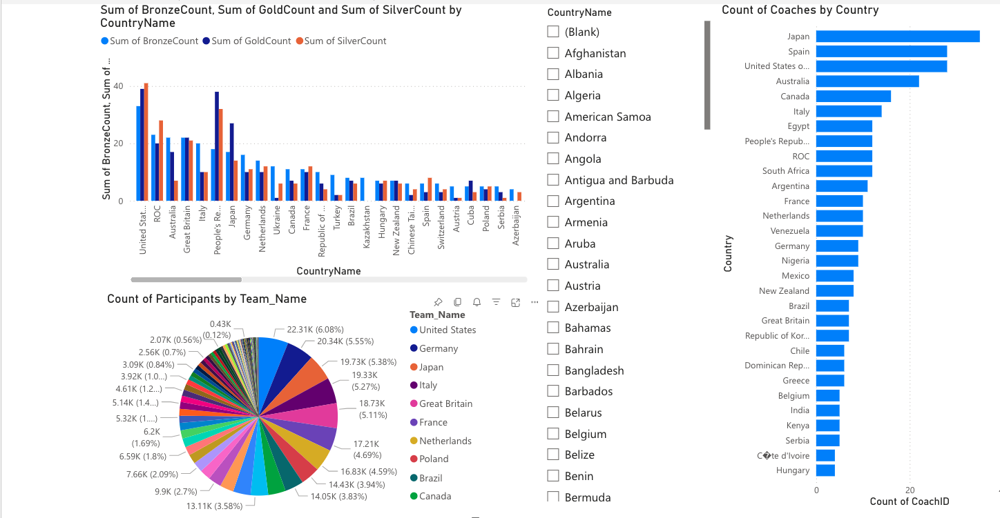
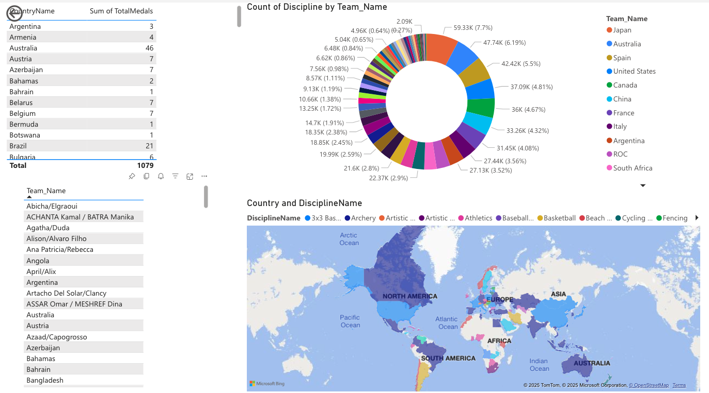

# 🏅 Olympic Data Analysis Using Azure and Power BI  

## 📌 Project Overview  
This project aims to **analyze Olympic Games data**, focusing on **athlete performance, medal distribution, and participation trends**. The data pipeline is built using **Microsoft Azure**, while **Power BI** is used for visualization. The structured **Medallion Architecture (Bronze, Silver, Gold)** ensures **clean, structured, and optimized data** for analysis.  

## 🎯 Key Features  
✅ **Data Pipeline in Azure** – Data ingestion, transformation, and structuring using **Azure Blob Storage, Azure Data Factory, and Databricks**.  
✅ **Data Cleansing & Structuring** – Cleaning raw data, handling duplicates, and structuring tables into **Fact & Dimension tables**.  
✅ **Power BI Dashboards** – Interactive dashboards for **medal counts, athlete performance, and participation trends**.  
✅ **Scalable Architecture** – Implements **Medallion Architecture** to improve data processing and querying performance.  

## 🛠️ Tools & Technologies  
- **Cloud Platform:** Microsoft Azure  
- **Storage:** Azure Blob Storage  
- **Data Processing:** Azure Data Factory, Apache Spark on Azure Databricks  
- **Development:** Jupyter Notebook  
- **Visualization:** Power BI  

## 📂 Data Processing Workflow  
### **1️⃣ Data Ingestion (Bronze Layer)**  
- Raw **Olympic records** are ingested into **Azure Blob Storage**.  
- Data is stored in its original form without modifications.  

### **2️⃣ Data Cleaning & Transformation (Silver Layer)**  
- **Cleaning Steps:**  
  - Remove **duplicates**.  
  - Fill in **missing values**.  
  - Standardize **text fields** for consistency.  
- **Transformation Steps:**  
  - Standardize **date formats**.  
  - Organize **categorical data** for analytics.  

### **3️⃣ Data Structuring (Gold Layer)**  
- **Dimension Tables:** Store static attributes like **athlete details, coaches, and teams**.  
- **Fact Tables:** Store numerical values like **medal counts, gender participation, and country-wise statistics**.  

## 📊 Fact & Dimension Tables  
### **Dimension Tables**  
| Table Name         | Description |  
|--------------------|------------|  
| `dim_athletes`    | Athlete details (name, country, discipline, gender, birthdate, height, weight, medals won) |  
| `dim_coaches`     | Coach details (name, country, discipline, gender) |  
| `dim_teams`       | Team details (name, country, discipline) |  

### **Fact Tables**  
| Table Name          | Description |  
|---------------------|------------|  
| `fact_medal_wins`  | Medal counts by country (gold, silver, bronze) |  
| `fact_entries_gender` | Gender participation across different sports |  

## 📊 Power BI Dashboards  

### **1️⃣ Medal Count Dashboard**  
- Total **gold, silver, and bronze medals** won by each country.  
- Top-performing countries based on medal counts.  
  

### **2️⃣ Athlete Performance Dashboard**  
- Performance trends across multiple Olympic Games.  
- Comparison of athlete statistics based on disciplines.  
  

### **3️⃣ Participation by Gender Dashboard**  
- Gender-based distribution of Olympic participants.  
- Trends in gender participation across different events.  
  

## 🚀 Getting Started  

### **1️⃣ Clone the Repository**  
```sh
git clone https://github.com/DhanyaRS0508/Olympic-Data-Analysis-DE.git
cd Olympic-Data-Analysis-DE
